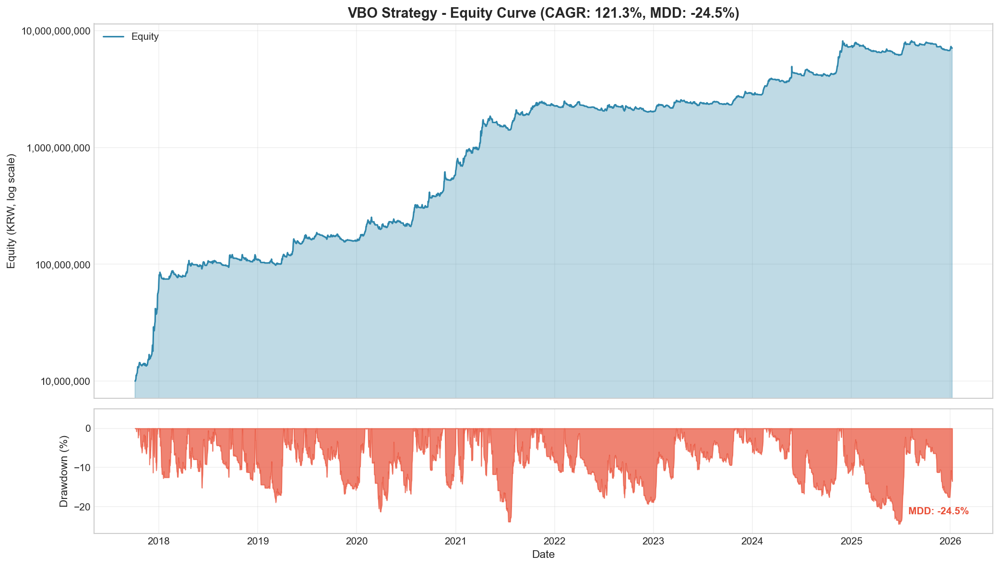
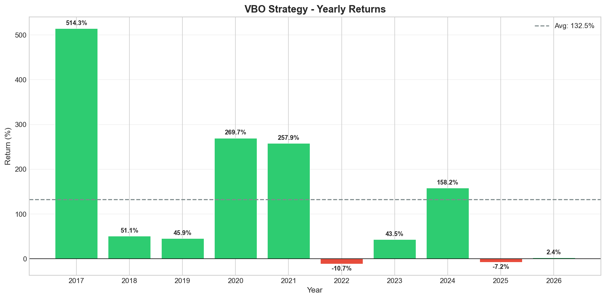
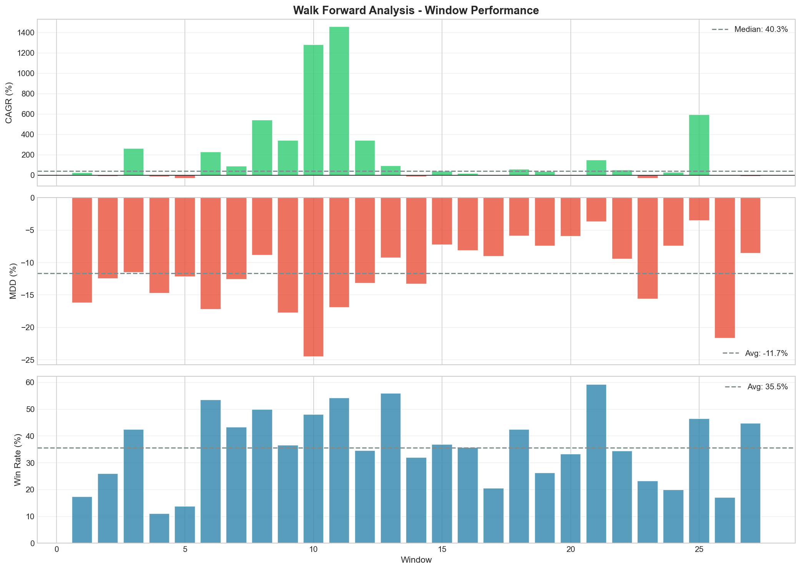
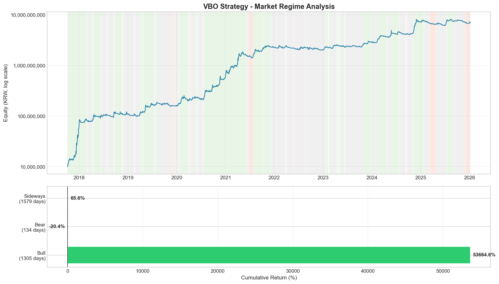

# BT - Cryptocurrency Backtesting Framework

A production-ready, event-driven quantitative trading backtesting engine for cryptocurrencies. Built with Python 3.14+, featuring clean architecture, type safety, and rigorous validation methods.

## 📈 Backtest Results

### VBO (Volatility Breakout) Strategy - Optimized

| Metric | Value |
|--------|-------|
| **CAGR** | 121.34% |
| **MDD** | -24.45% |
| **Sortino Ratio** | 3.28 |
| **Win Rate** | 35.34% |
| **Profit Factor** | 1.69 |
| **Period** | 2017-2026 (9 years) |

### Visualizations

<details>
<summary>📊 Equity Curve</summary>


</details>

<details>
<summary>📅 Yearly Returns</summary>


</details>

<details>
<summary>🔄 Walk Forward Analysis Results</summary>


</details>

<details>
<summary>📉 Market Regime Analysis</summary>


</details>

### Key Findings

1. **Noise Filter Removal**: Improved CAGR from ~70% to ~120% while maintaining similar MDD (~-25%)
2. **Market Regime Sensitivity**: Exceptional performance in bull markets (2017: +514%, 2020: +270%), struggles in bear markets (2022: -11%)
3. **WFA Validation**: 67% of windows show positive returns (18/27 windows)

## ✨ Features

- **Event-Driven Architecture**: Bar-by-bar simulation mimicking real trading environments
- **Composable Strategies**: Mix and match buy/sell conditions, pricing logic, and allocation strategies like building blocks
- **Type Safety**: Full Pydantic validation and type hints throughout the codebase
- **Decimal Precision**: All financial calculations use `Decimal` to avoid floating-point errors
- **Smart Data Collection**: Upbit API integration with exponential backoff, rate limiting, and incremental updates
- **Robust Validation**: Built-in Walk Forward Analysis (WFA) and Combinatorial Purged Cross-Validation (CPCV)

## 📁 Project Structure

```text
bt/
├── pyproject.toml          # Project dependencies and configuration
├── src/bt/                 # Core source code
│   ├── config.py           # Settings management (Pydantic Settings)
│   ├── logging.py          # Structured logging (JSON/Text)
│   ├── domain/             # Domain models and types
│   │   ├── models.py       # Pydantic models (BacktestConfig, Trade, Position)
│   │   └── types.py        # Financial types (Amount, Price, Quantity)
│   ├── engine/             # Backtesting engine
│   │   ├── backtest.py     # Main BacktestEngine
│   │   ├── portfolio.py    # Portfolio management
│   │   └── data_provider.py # Data access layer
│   ├── strategies/         # Strategy components
│   │   ├── conditions.py   # Buy/Sell conditions
│   │   ├── pricing.py      # Price calculation
│   │   ├── allocation.py   # Position sizing
│   │   └── vbo.py          # VBO strategy factory
│   ├── validation/         # Strategy validation
│   │   ├── wfa.py          # Walk Forward Analysis
│   │   └── cpcv.py         # Combinatorial Purged CV
│   ├── data/               # Data collection
│   │   └── fetcher.py      # Upbit API fetcher
│   └── reporting/          # Performance reporting
│       ├── metrics.py      # CAGR, MDD, Sortino, etc.
│       └── visualization.py # Chart generation
├── examples/               # Example scripts
├── tests/                  # Unit tests (pytest)
└── notebooks/              # Jupyter notebooks for experiments
```

## 🚀 Installation

Requires Python 3.14+.

### Using `uv` (Recommended)

```bash
# Install uv if not present
curl -LsSf https://astral.sh/uv/install.sh | sh

# Create and activate virtual environment
uv venv
source .venv/bin/activate  # Windows: .venv\Scripts\activate

# Install dependencies
uv pip install -e ".[dev]"
```

### Using `pip`

```bash
pip install -e ".[dev]"
```

## 💡 Quick Start

### 1. Fetch Data

Collect OHLCV data from Upbit. The smart fetcher automatically continues from the last downloaded data.

```bash
python examples/fetch_data.py
```

- Default symbols: BTC, ETH, XRP, TRX
- Intervals: 60min, 4h, daily, weekly, monthly
- Storage: `data/{interval}/{symbol}.parquet`

### 2. Run Backtest

Execute the VBO strategy with composable components.

```bash
python examples/run_backtest.py
```

Output includes CAGR, MDD, Win Rate, Sortino Ratio, and sample trade logs.

### 3. Validate Strategy

Run Walk Forward Analysis to check for overfitting.

```bash
python examples/run_wfa_validation.py
```

### 4. Generate Full Report

Create comprehensive report with all visualizations.

```bash
python examples/generate_report.py
```

## 📊 Strategy Details

### VBO (Volatility Breakout) Strategy

**Buy Conditions:**
1. No open position for the symbol
2. Price breaks above volatility breakout line (Open + Range × K)
3. Price above short-term moving average (trend filter)
4. Price above long-term moving average (trend confirmation)

**Sell Conditions:**
1. Price closes below short-term moving average

**Allocation:**
- Cash Partition: Divide capital equally among N symbols, allocate 1/N per signal

## 📈 Validation Methods

### Walk Forward Analysis (WFA)

- Splits data into sequential train/test windows
- Prevents look-ahead bias
- Tests strategy robustness across different market regimes

```python
from bt.validation.wfa import WalkForwardAnalysis

wfa = WalkForwardAnalysis(
    train_periods=365,
    test_periods=90,
    step_periods=90,
)
results = wfa.run(data, backtest_func)
```

### Combinatorial Purged Cross-Validation (CPCV)

- Handles time-series data properly with purging and embargo
- Prevents data leakage between train/test sets

```python
from bt.validation.cpcv import CombinatorialPurgedCV

cpcv = CombinatorialPurgedCV(
    num_splits=5,
    embargo_pct=0.01,
    purge_pct=0.05,
)
results = cpcv.run(data, backtest_func)
```

## 🛠 Supported Data Intervals

| Interval | Description |
|----------|-------------|
| `minute1` - `minute240` | Intraday candles |
| `day` | Daily candles |
| `week` | Weekly candles |
| `month` | Monthly candles |

## 🧪 Development

### Code Quality Checks

```bash
# Run all checks (format, lint, type-check, test)
./scripts/check.ps1

# Or individually:
ruff format .
ruff check . --fix
mypy src/bt --strict
pytest --cov=src/bt
```

### Running Tests

```bash
pytest                          # Run all tests
pytest --cov=src/bt             # With coverage
pytest -v tests/test_wfa.py     # Specific test file
```

## 📝 Research Notes

### Experiment: Noise Filter Removal

**Hypothesis**: The noise filter in VBO strategy may limit entry opportunities and reduce returns.

**Method**:
1. Hypothesis testing in Jupyter notebook with vectorized backtest
2. Validation with event-driven engine
3. Overfitting check with WFA/CPCV

**Results**:

| Condition | CAGR | MDD | Sortino |
|-----------|------|-----|---------|
| With Noise Filter | ~70% | -25% | ~2.0 |
| Without Noise Filter | **121%** | -24% | **3.28** |

**Conclusion**: Removing noise filter improved CAGR by +73% while maintaining similar risk (MDD). However, performance varies significantly across market regimes.

### Future Improvements

- [ ] Dynamic position sizing based on market regime detection
- [ ] Parameter optimization with Grid Search / Optuna
- [ ] Multi-asset correlation-based rebalancing
- [ ] Live trading bot integration

## 📄 License

MIT License